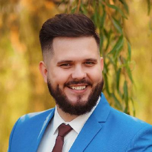

 

**Возраст 26 лет**

**Gmail: amadon232@gmail.com**

**Телефон: +375293869496**

##Привет меня зовут Шакура Денис и я начал обучаються в группе Front-end, а это мой личный CV который я буду обновлять и дополнять по мере надобности.

## Коротко обо мне

==**Планирую связать свою деятельность с IT технологиями и развиваться в этом направлении. В данной сфере чувствую своё призвание. Являюсь активным пользователем ПК - в связи с чем и развился интерес к тому что-бы понять как это работает. Считаю себя человеком который весьма быстро усваивает что-то новое и развивается в этом направлении. Так же, по моему мнению, обладаю достойным уровнем владения Английским языком.**==

* * *
